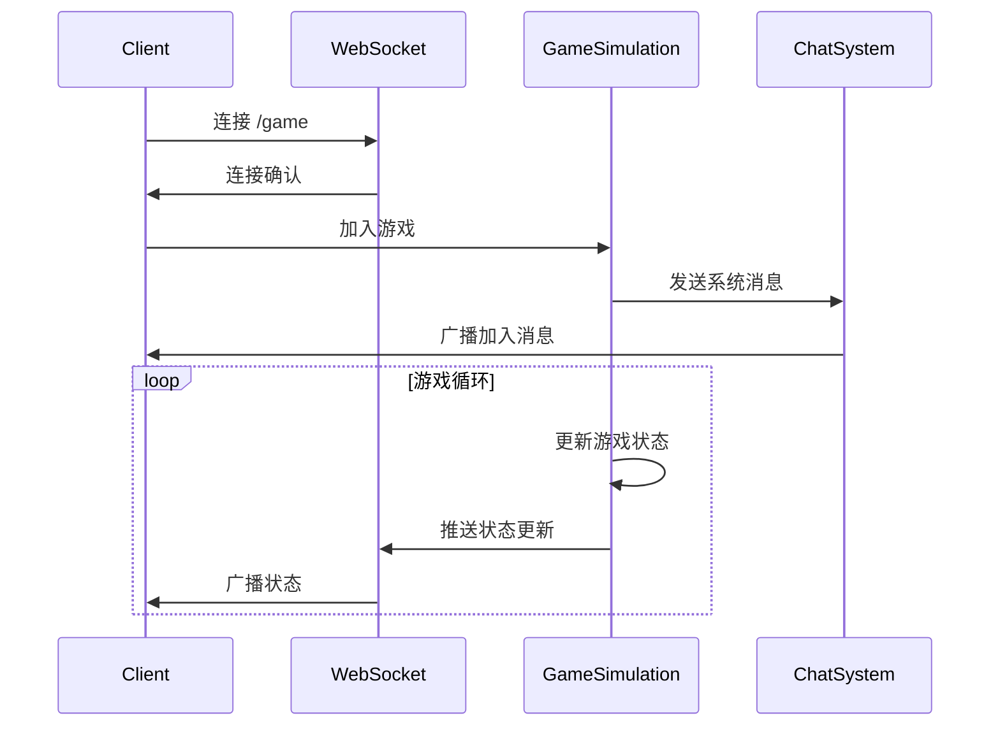
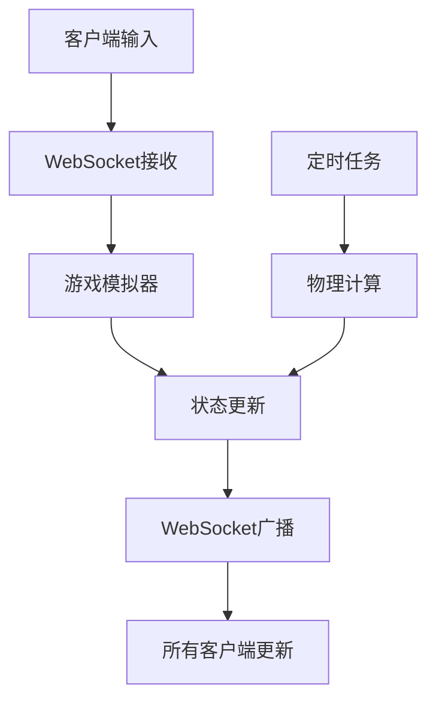

# H5 三体运动与赛车游戏

这是一个基于Spring Boot的多人在线H5游戏项目，包含三体运动模拟和原野赛车两个游戏模块。项目采用WebSocket实现实时多人交互，使用HTTPS确保通信安全。

## 功能特点

- 多人实时交互：所有用户共享同一游戏进程
- 三体运动模拟：模拟三个天体的引力运动
- 原野赛车游戏：支持多人竞速和对战
- 实时聊天室：带时间戳的系统消息和用户消息
- 安全通信：强制HTTPS访问和WSS连接
- 用户状态同步：服务端统一管理游戏状态

## 目录结构

```
src/main/java/com/h5game/threebody/
├── config/          
│   ├── SecurityConfig.java       # 安全配置，强制HTTPS
│   └── WebSocketConfig.java      # WebSocket配置，设置端点和消息代理
├── controller/      
│   ├── ChatController.java       # 处理聊天消息
│   └── ThreeBodyController.java  # 处理游戏路由和状态
├── model/          
│   ├── ChatMessage.java         # 聊天消息模型
│   ├── RacingInput.java         # 赛车控制输入
│   ├── RacingState.java         # 赛车游戏状态
│   └── SimulationState.java     # 三体模拟状态
├── entity/         
│   ├── Body.java               # 天体实体
│   ├── Car.java                # 赛车实体
│   └── Bullet.java             # 子弹实体
├── simulation/     
│   ├── ThreeBodySimulation.java # 三体运动计算
│   └── RacingSimulation.java    # 赛车游戏逻辑
└── ThreeBodyApplication.java    # 应用入口
```

## 核心算法

### 三体运动模拟

三体运动模拟基于经典的引力定律实现：

1. 引力计算：
```java
F = G * (m1 * m2) / r^2
```

2. 加速度更新：
```java
ax = Fx / m
ay = Fy / m
```

3. 速度更新（带阻尼）：
```java
vx = (vx + ax * dt) * damping
vy = (vy + ay * dt) * damping
```

4. 位置更新：
```java
x = x + vx * dt
y = y + vy * dt
```

### 赛车游戏逻辑

1. 碰撞检测：使用矩形碰撞箱
2. 子弹轨迹：线性运动
3. 边界处理：反弹或消除

## 系统架构

### WebSocket通信时序



### 状态同步设计



## 安全特性

1. HTTPS配置：
- 使用自签名证书
- 强制SSL通道
- 配置TLS

2. Spring Security：
- 请求通道安全
- CSRF保护
- WebSocket安全

## 运行指南

1. 构建项目：
```bash
mvn clean install
```

2. 运行应用：
```bash
java -jar target/threebody-0.0.1-SNAPSHOT.jar
```

3. 访问地址：
- https://localhost:8443 - 主页
- https://localhost:8443/simulation.html - 三体模拟
- https://localhost:8443/racing.html - 赛车游戏

## 技术栈

- 后端：Spring Boot 3.1.0
- 安全：Spring Security
- 通信：WebSocket (STOMP)
- 前端：HTML5 Canvas + JavaScript
- 构建：Maven

## 注意事项

1. 首次访问会显示证书警告，这是因为使用了自签名证书
2. 生产环境部署时需要替换为正式SSL证书
3. 游戏性能与服务器配置和网络延迟相关
